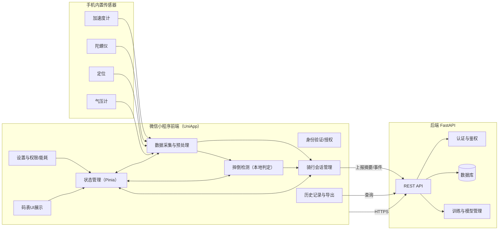
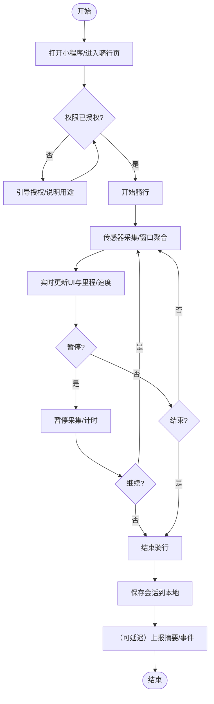
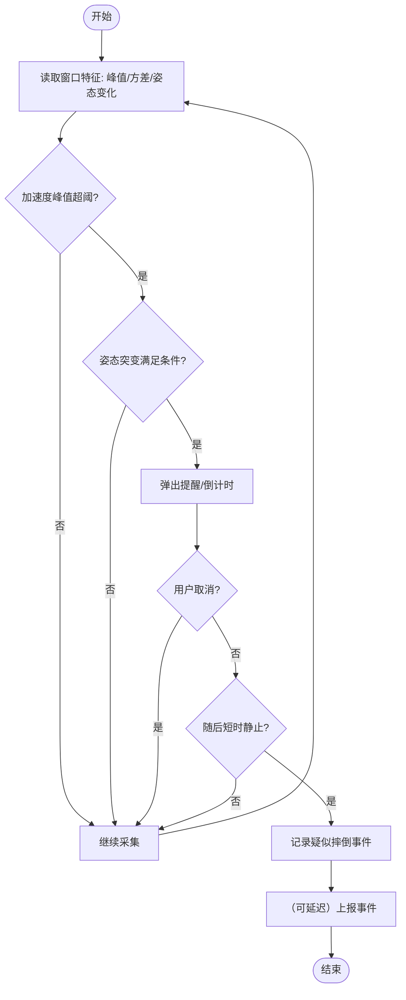
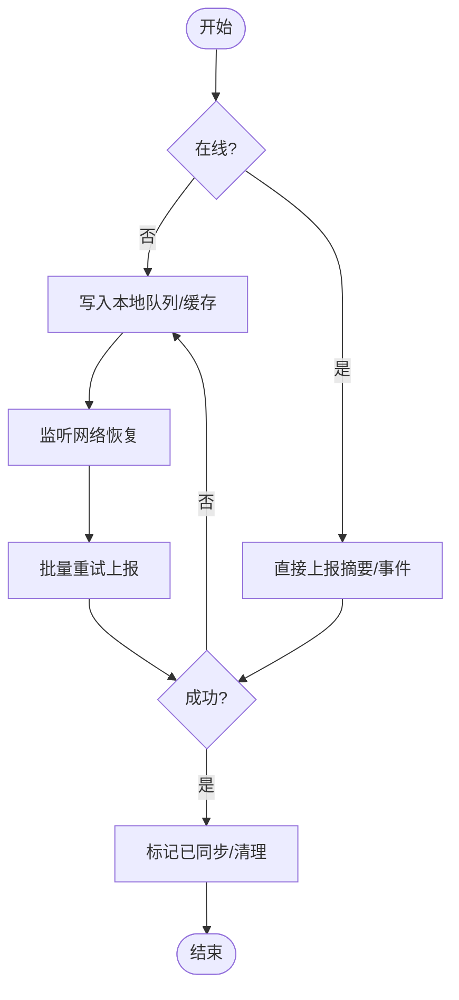
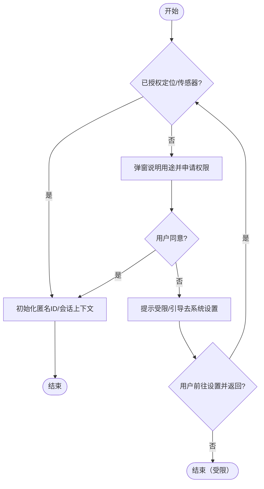
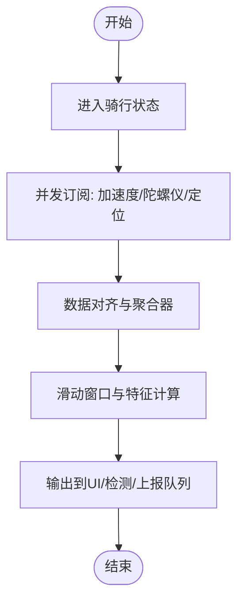
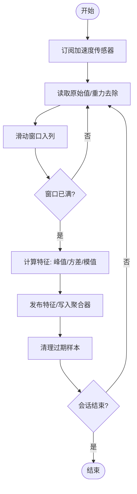
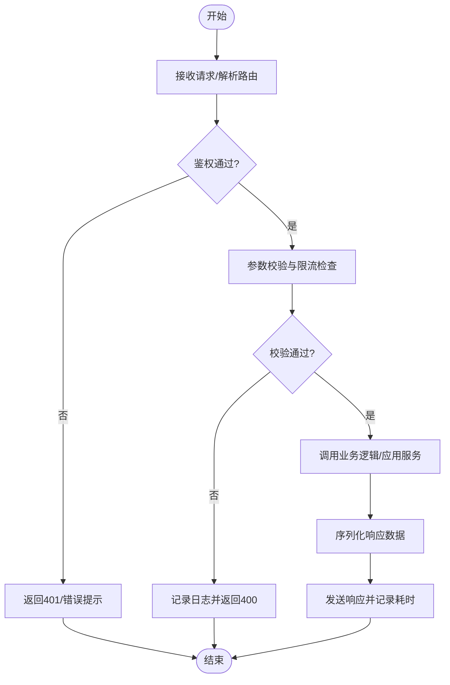
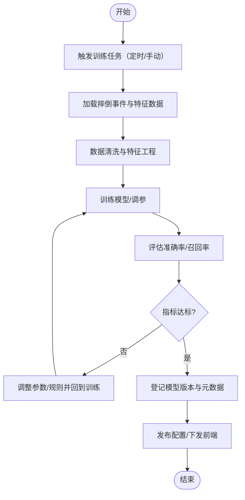

# 开题报告：支持摔倒检测的骑行码表小程序

## 第一章 引言、动机与要解决的问题

### 1.1 引言
在城市通勤与休闲运动日益普及的今天，骑行已经成为许多人低成本、低碳出行和锻炼身体的首选方式。然而，骑行过程中因路面坑洼、刹车失衡、与其他交通参与者交互不当等原因引发的意外摔倒时有发生。对于独自出行者而言，摔倒后无法及时获知自身状态或向外界发出提醒，可能导致救援滞后、伤情加重。同时，不少骑行者也希望便捷地记录里程、速度、时间等基础数据，但传统专业码表成本较高、配置复杂，通用运动 App 又常常过于臃肿、学习成本高。

基于上述现实需求，我们希望提供一个“够用、好用、易用”的解决方案：在无需额外硬件的前提下，利用智能手机内置的加速度计、陀螺仪、定位等传感能力，一方面简洁记录骑行关键指标，另一方面在检测到疑似摔倒时做出及时、克制的提示，降低误报与打扰。为此，本系统设计并实现一个运行在微信生态内的轻量小程序前端，配合后端服务完成必要的数据存储与分析，兼顾低门槛与可扩展性。

因此，本系统旨在：1）记录骑行基础数据（里程、速度、时长等）；2）在本地实时监测传感器异常并判断疑似摔倒；3）提供事后查看与导出数据的能力；4）在保障隐私与能耗可控的前提下，提供稳定可靠的使用体验。

> 注：更多行业背景可参考道路交通伤害与可穿戴设备摔倒检测的公开资料与科普文章[1][2]，以及微信小程序关于传感器与定位能力的官方文档[3]。

### 1.2 动机
- 在什么情况下：日常通勤、休闲骑行以及入门骑友对专业码表的门槛感到不适应，却又需要基础数据记录与安全提醒；部分用户不愿安装体量较大的专用 App，更偏好即开即用、轻量不打扰的工具。
- 要做什么事/为什么这样做：基于微信小程序实现“骑行码表 + 摔倒检测”的一体化工具，尽量依托手机原生传感器完成本地判定，减少外设依赖与网络开销；同时保留后端接口以便历史查询与后续算法升级。
- 这样做的好处（贡献）：
  - 低门槛：无安装成本，扫码/搜索即用，适合更广泛人群。
  - 易上手：界面聚焦少量必需指标，弱化配置，开骑即记。
  - 安全性：在本地对“强冲击 + 随后静止/姿态异常”等模式进行综合判定，疑似摔倒时快速提醒，支持手动取消误报。
  - 轻干扰：合理的采样频率与前后台策略，尽量降低功耗与误报率。
  - 可扩展：后端存储结构与训练管线预留，支持后续引入更稳健的模型与个性化参数。

所以，本系统旨在开发一个“轻量级、可扩展、注重隐私与能耗控制”的骑行码表小程序，既满足日常记录，又兼顾基本的摔倒检测与提示能力。

### 1.3 要解决的问题
为实现“骑行记录 + 摔倒检测”的目标，本系统需要完成以下功能与设计要点：

(1) 数据的采集：
- 传感器来源：手机内置加速度计与陀螺仪为核心，辅以定位（GPS/北斗）获取速度与轨迹，条件允许可利用气压计辅助海拔与坡度估计。
- 采样策略：在前台骑行页保持稳定采样并采用滑动窗口聚合（如均值、方差、峰值）以降低噪声；在后台或锁屏时降频与事件触发结合，兼顾能耗与时效。
- 本地预处理：对加速度模值与角速度变化进行阈值与模式复合判定，减少原始点数据的频繁上传与隐私暴露。

(2) 数据库设计（后端 FastAPI 服务）：
- 核心实体：`users`（或匿名设备标识）、`ride_sessions`（骑行会话）、`sensor_events`（聚合后的传感片段/特征、可选）、`fall_events`（疑似摔倒记录）、`settings`（个性化阈值、偏好）。
- 关系与约束：`ride_sessions` 关联 `users`；`fall_events` 关联具体会话与时间戳；必要字段包含时间、空间与设备信息；对可能敏感字段采用脱敏/最小化存储策略。
- 持久化与检索：按会话与日期范围高频检索，支持分页与聚合统计（骑行总时长、总里程、平均速度等）。

(3) 接口设计（小程序 ↔ 后端）：
- 会话管理：创建/结束骑行会话（POST/PUT `/api/sessions`）。
- 数据上报：按窗口上报特征或关键节点（POST `/api/sessions/{id}/segments`），在弱网或离线时落本地队列，恢复后补传。
- 摔倒事件：上报/同步疑似摔倒（POST `/api/falls`），并支持事后标注“误报/确认”。
- 历史与统计：查询会话列表/明细与统计（GET `/api/sessions`、`/api/stats`）。

(4) 摔倒检测算法：
- 规则为先：以“高加速度峰值 + 姿态突变 + 随后短时静止/低活动”作为基本模式，使用双阈值与时间窗口避免瞬时噪声；提供倒计时提示与手动取消。
- 可升级空间：保留特征与标签上报能力，支持在后端训练更稳健的模型（如浅层树模型），通过参数/模型版本下发实现灰度迭代。

(5) 前端界面与交互：
- 骑行页：实时显示速度、里程、时长，开始/暂停/结束一键操作。
- 摔倒提醒：弹窗 + 声光提示 + 倒计时，允许“我没事”快速消除；结束后自动记录事件并可备注。
- 历史页：按日期/会话查看关键指标与疑似事件分布，支持导出。

(6) 权限与隐私：
- 仅在骑行时申请必要权限（传感器、定位），默认最小化采集与本地预处理；说明用途并提供一键关闭摔倒检测。
- 传输最小化与加密通道（HTTPS）；后端对敏感字段脱敏与访问鉴权。

(7) 能耗与鲁棒性：
- 前后台差异化采样与上报节流；异常网络下自动重试与断点续传。
- 算法抗噪：对传感器抖动、手机放置角度变化进行去趋势与归一化，降低误报。

(8) 工程与运维：
- 前端基于 UniApp（微信小程序）与 Pinia 状态管理；后端基于 FastAPI，提供训练脚本与数据校验工具；保留自动化测试与日志追踪接口，便于课程验收与后续维护。

## 第二章 系统框架和模块划分

在展开具体流程图之前，先用“框架图”描述系统整体架构与组成（属于上层设计），再用“流程图”刻画典型功能的处理步骤（属于功能级流程）。

### 2.1 系统框架（Mermaid）
下图为系统总体架构，包含前端小程序、手机传感器与后端服务三部分，用于说明数据流与职责边界。

<div align="center">



<p>图2-1 系统总体框架</p>

</div>

为便于阅读，下列对框架图中的关键功能进行简述：
- 身份验证/授权：获取必要的定位、传感器权限，初始化匿名标识。
- 数据采集与预处理：对加速度、陀螺仪、定位等进行采样、去噪、滑动窗口聚合。
- 摔倒检测（本地）：基于阈值与模式结合做快速判定并发出提醒。
- 骑行会话管理：开始/暂停/结束骑行，归档会话数据与事件。
- 历史记录与导出：查询统计、导出分享等。

为体现流程层面的设计，给出典型功能的流程图（注意：以下为流程图，非框架图）。

#### 2.1.1 骑行记录主流程（前端）
说明：从进入骑行页到结束会话的主线流程。

<div align="center">



<p>图2-2 骑行记录主流程</p>

</div>

#### 2.1.2 摔倒检测（本地）流程
说明：在本地对窗口特征进行判定，减少误报并提供用户取消。

<div align="center">



<p>图2-3 摔倒检测本地流程</p>

</div>

#### 2.1.3 数据上报与同步流程
说明：在弱网/离线条件下，采取本地队列与断点续传策略。

<div align="center">



<p>图2-4 数据上报与同步流程</p>

</div>

### 2.2 模块划分与描述
本节覆盖小程序前端与后端服务两个层面，列出关键模块职责，并对其中核心模块给出流程图与细化说明。

- 身份验证（前端）：处理权限申请、匿名ID初始化与受限场景提示。
- 数据采集（前端）：订阅传感器、去噪与滑动窗口聚合、特征输出。
- 骑行会话管理（前端）：开始/暂停/结束、里程与统计聚合、异常保护。
- UI展示（码表）（前端）：实时指标渲染、状态提示与交互控件。
- 历史记录与导出（前端）：会话检索、详情与导出分享。
- 设置与隐私/能耗（前端）：权限开关、阈值参数、前后台策略与节电。
- 接口服务（后端）：暴露 REST API，处理鉴权、校验与业务调度。
- 数据存储与管理（后端）：负责会话、传感摘要、摔倒事件等持久化与索引。
- 模型训练与配置下发（后端）：利用采集到的标注数据迭代检测模型，分发参数版本。

#### 2.2.1 身份验证
模块功能：
- 申请并管理定位、传感器等必要权限；
- 初始化匿名设备/用户标识，用于会话与本地数据关联；
- 在受限场景提供引导与降级（可仅记录离线基础数据）。

流程图如下：

<div align="center">



<p>图2-5 前端身份验证流程</p>

</div>

#### 2.2.2 数据采集
模块功能：
- 并发订阅加速度、陀螺仪与定位数据源；
- 在前台保持稳定采样，后台采用降频与事件触发；
- 滑动窗口聚合并输出特征，供 UI 与检测算法消费。

并发说明：加速度、陀螺仪、定位可并行采集，随后在聚合器中按时间戳对齐并生成统一窗口特征。先给出总体流程，再对“加速度采样与滑动窗口处理”单独细化。

总体流程图：

<div align="center">



<p>图2-6 数据采集总体流程（并发）</p>

</div>

并发细化（以加速度为例）：

<div align="center">



<p>图2-7 加速度采样与滑动窗口处理（细化）</p>

</div>

#### 2.2.3 接口服务（后端）
模块功能：
- 统一接收前端 HTTPS 请求，解析路由与参数；
- 调用鉴权组件校验匿名令牌或安全密钥；
- 对请求体做模式校验与限流控制，将有效请求分派给业务逻辑；
- 记录请求/响应日志与异常。

流程图如下：

<div align="center">



<p>图2-8 后端接口服务处理流程</p>

</div>

#### 2.2.4 数据存储与管理（后端）
模块功能：
- 为骑行会话、传感器摘要、摔倒事件、用户设置等提供持久化结构；
- 负责事务控制、索引优化与数据归档；
- 对外提供分页检索、聚合统计与历史导出能力；
- 对敏感字段执行脱敏策略，保障最小化存储。

流程图如下：

<div align="center">

```mermaid
flowchart TD
  A([开始]) --> B[接收写入/更新请求]
  B --> C[开启事务/连接池获取会话]
  C --> D[映射模型并构造SQL]
  D --> E{执行成功?}
  E -- 否 --> F[回滚事务并记录错误]
  F --> G[返回失败结果]
  G --> H([结束])
  E -- 是 --> I[提交事务]
  I --> J[更新缓存/索引(可选)]
  J --> L[返回成功结果]
  L --> H([结束])
```

<p>图2-9 数据存储与管理流程</p>

</div>

#### 2.2.5 模型训练与配置下发（后端）
模块功能：
- 收集前端标注的“误报/确认”事件，构建训练数据集；
- 对数据进行清洗、特征工程与版本化管理；
- 训练并评估阈值或轻量模型，合格后登记版本与元数据；
- 将最新参数下发至前端或作为接口默认配置。

流程图如下：

<div align="center">



<p>图2-10 模型训练与配置下发流程</p>

</div>

## 参考文献
[1] 世界卫生组织（WHO）道路交通安全相关报告与科普资料（关键词：WHO 道路交通 伤害 报告）。

[2] 可穿戴/手机终端摔倒检测的公开介绍与案例（关键词：Apple Watch 摔倒检测；智能手机 传感器 摔倒检测）。

[3] 微信小程序官方文档：传感器与定位能力（关键词：微信小程序 传感器 加速度计 陀螺仪 定位）。
